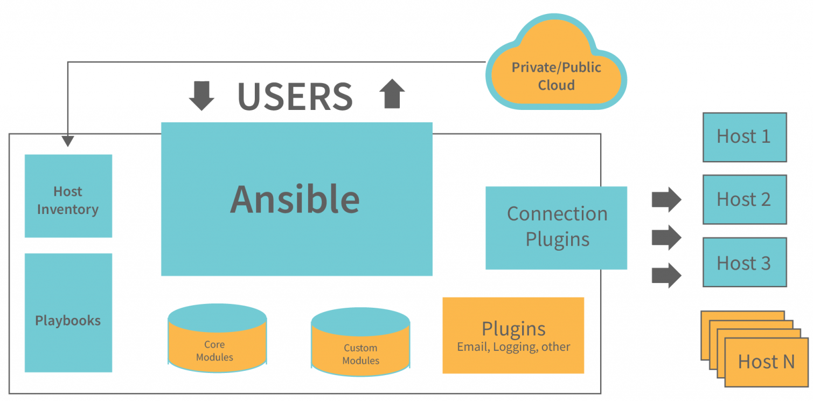
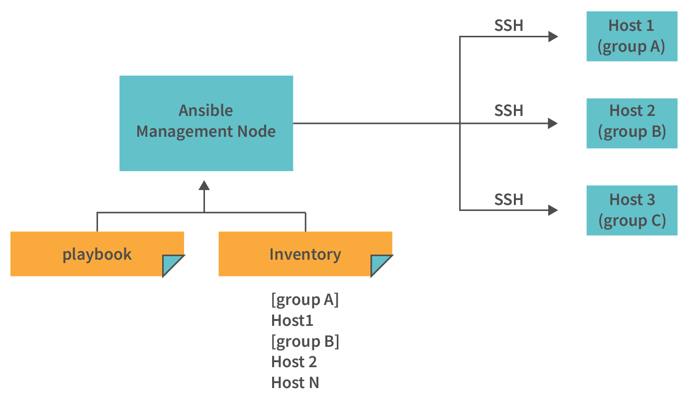

# Minimum Requirement #
* Linux OS (Alma, Centos, Rocky, Ubuntu or WSL on windows)
* Python installation
* Virtualenv for python
* Pip for python
* bash 4.2+
# Architecture #

# Usage #

# Linux installation #
## Basic linux libs installation ##
```
sudo dnf update
sudo dnf install epel-release
```
## Ansible Install ##
```
dnf install ansible
```
# Python Ansible #
## Ansible virtualenv ##
Create virtualenv for ansible
```bash
mkdir -p ~/ansible_workspace/src
cd ~/ansible_workspace
virtualenv venv
source venv/bin/activate
```
Make sure you are in a virtual environment once you source
```
pip install ansible
```
Once you install ansible you can check the installation like below
```bash
(venv) localhost:ansible_workspace$ ansible --version
ansible [core 2.13.5]
  config file = None
  configured module search path = ['/Users/arjun/.ansible/plugins/modules', '/usr/share/ansible/plugins/modules']
  ansible python module location = /Users/arjun/development/ansible/blah/lib/python3.9/site-packages/ansible
  ansible collection location = /Users/arjun/.ansible/collections:/usr/share/ansible/collections
  executable location = /Users/arjun/development/ansible/blah/bin/ansible
  python version = 3.9.8 (v3.9.8:bb3fdcfe95, Nov  5 2021, 16:40:46) [Clang 13.0.0 (clang-1300.0.29.3)]
  jinja version = 3.1.2
  libyaml = True
```
# Configuring Ansible #
When configuring a ansible in a system level vs virtualenv there are a lot of difference where files needs to be placed.
## host list ##
**System Level**
```ini
[webservers]
lon-ansible-server
80.23.45.101
```
**Environment / Playbook**
## ansible.cfg ##

# Ad Hoc command #
```bash
ansible <HOST GROUP> -m <MODULE NAME> -a "<ARGS>" -u <USER> -i <INVENTORY>
```
### Ping ###
ansible all -u root -m ping
### Copy and create files ###
```bash
ansible all -u root -m copy -a "src = /etc/yum.conf dest = /tmp/yum.conf"
```
```bash
ansible all -u root -m file -a "dest = /path/user1/new mode = 777 owner = user1 group = user1 state = directory"
```
### Installing packages ###
```bash
ansible all -u root -m yum -a "name = demo-tomcat-1 state = latest"
```
### Shell ###
```bash
ansible all -u root -m shell -a "ls -l"
```